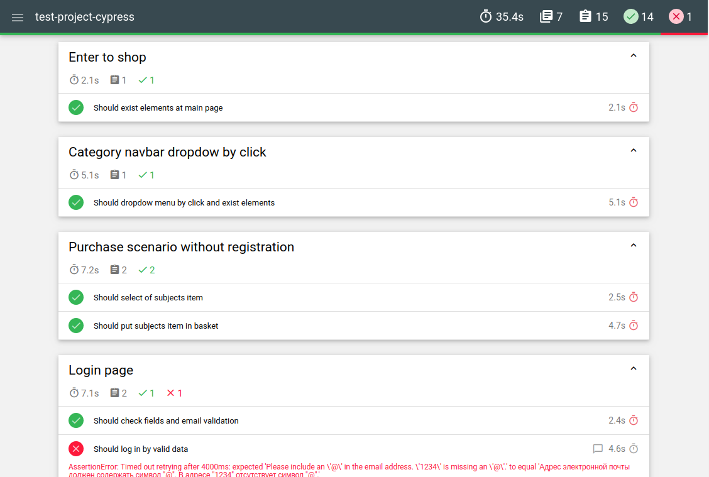

# Test-project-cypress
Project for testing with CI on Github actions and publish a report on GitHub pages

## To get report
If you create PR or push your code in `main` branch will start Github actions for running cypress test and you can look at the new report on [github pages](https://farvater-max.github.io/test-project-cypress/) in this repo



<details>
  <summary>How it works</summary>
  
   The project has [github workflow](https://github.com/Farvater-max/test-project-cypress/blob/main/.github/workflows/cypress-test.yaml) which is triggered by `push` or `create pull request` in `main` branch. Its flow runs remotely `Ubuntu` with node and installs `npm dependensies` including `cypress`. After that flow will start script command `npm run test` and publish commit the change on GitHub pages and shaping the new test report. Also if you create `pull request` after tests run you'll get a comment in the pull request with a message about success actions and a link on the new test report  
  
   Command `npm run test` in turn launches `cypress run --browser Chrome` and starts a series of commands namely `combine-reports`, `generate-report`, which response for the formation and combine JSON report, generating from JSON report HTML report, and clumping to the final report. It works by using packages "mochawesome", "mochawesome-merge", and "mochawesome-report-generator" 
  
   The final report includes passed and failed tests, but if the test case failed, the report has contained a video of passing the test case and a screenshot at the moment of the failed check. The test project has a few allowed mistakes to demonstrate how looks failed test case in a report

</details>

## local development
First of all, pull this project and install npm dependencies
```
npm i
```
To run test launch command
```
npm run test
```
After end running tests, HTML-report is located in folder  ```public/index.html```
If some check failed in the report you can watch screenshot website in the moment of fail check  

To clean last run test results before starting a new iteration use command
```
npm run pretest
```


